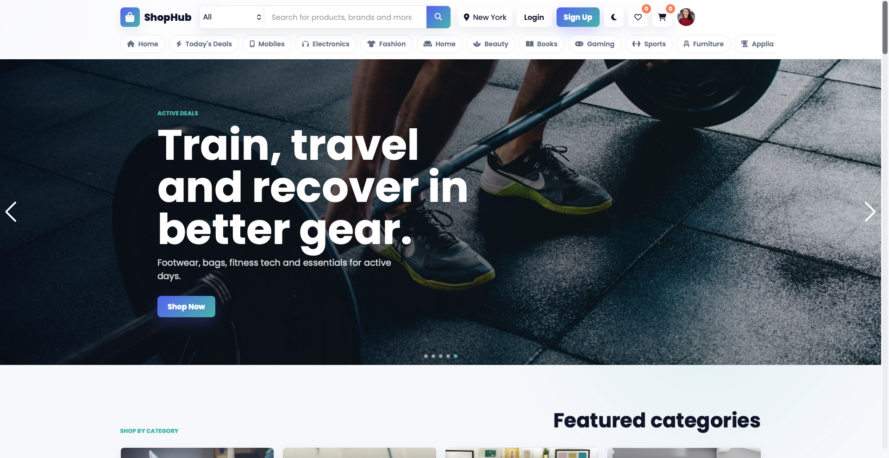

# 🛍️ ShopHub

A modern and responsive eCommerce shopping website inspired by platforms like Amazon and Flipkart.

Built for learning, frontend practice, and portfolio showcasing using HTML, CSS, and JavaScript.

---

## 🌐 Live Demo

👉 **Go Live:** https://ajayvirjangid.github.io/ShopHub/

> If the website is not live yet, enable **GitHub Pages** by selecting the **main** branch and **/(root)** folder in the repository settings.

---

## 📸 Preview



*(Replace the image above with your project screenshot.)*

---

# ✨ Features

- 🛒 Modern eCommerce Home Page
- 📱 Fully Responsive Design
- 🔍 Search Bar
- 🏷️ Product Categories
- ⭐ Featured Products
- 🔥 Deals & Offers Section
- 🖼️ Hero Banner
- 🛍️ Shopping Cart UI
- ❤️ Wishlist UI
- 👤 User Account Section
- 📦 Product Cards
- ⚡ Smooth UI Animations
- 🎨 Clean & Modern Design

---

# 🛠️ Tech Stack

- HTML5
- CSS3
- JavaScript (Vanilla)
- Font Awesome
- Google Fonts

---

# 📁 Project Structure

```
ShopHub/
│
├── assets/
│   ├── css/
│   ├── js/
│   ├── images/
│   └── icons/
│
├── index.html
├── README.md
└── LICENSE
```

---

# 🚀 Getting Started

### Clone Repository

```bash
git clone https://github.com/AjayvirJangid/ShopHub.git
```

### Open Project

```bash
cd ShopHub
```

Simply open:

```
index.html
```

in your browser.

Or use VS Code Live Server.

---

# 💻 Deployment

The project can be deployed using:

- GitHub Pages
- Netlify
- Vercel

---


---

# 🎯 Future Improvements

- Product Details Page
- Login & Signup
- Shopping Cart Functionality
- Wishlist
- Checkout Page
- Payment Integration
- Backend Integration
- Firebase Authentication
- Product Filtering
- Dark Mode

---

# 🤝 Contributing

Contributions, issues, and feature requests are welcome.

Feel free to fork this repository and submit a Pull Request.

---

# 👨‍💻 Author

**Ajayvir Jangid**

- Unreal Engine Developer
- Frontend Developer
- UI Enthusiast

GitHub:
https://github.com/AjayvirJangid

Portfolio:
https://ajayvirjangid.github.io/portfolio-live/

---

# ⭐ Support

If you like this project, don't forget to ⭐ star the repository.

---

## 📄 License

This project is licensed under the MIT License.